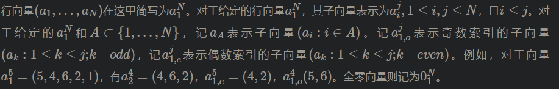

## 目标

目前对于极化码主流的构造方法是由Tal和Vardy两人给出。该方法基于极化码的基本框架，采用迭代的方法逐步计算各个极化信道的信道参数值。通常该参数值为信道容量或者是信道的巴氏参数。随着码长的不断增加，极化信道的输出符号集也指数增加，对于除BEC信道外的信道而言，精确计算其信道容量或者巴氏参数要耗费大量的计算资源。而Tal-Vardy算法采用一种有效近似的方法对相应的参数进行快速估计，其精度也可以任意调节。相比于传统的蒙特卡洛法、高斯近似法、密度进化法等都具有更好的理论分析模型。但以上所涉及的极化码构造方法均适配于经典的SC译码算法。对于性能更好的SCL，或者CA-SCL译码算法，由于其更复杂的译码过程，其下适配的最优构造方法仍是业内的开放问题。目前主要采用SC下的构造加上SCL或者CA-SCL的译码方法。但该方法并不能保证最优的性能。因此，本课题将尝试用最新的遗传算法和演化计算方法来寻找更好的极化码构造方法。其基本原理是先通过对极化码的信息集合和冻结集合进行二进制编码生成初始族群，然后对其进行遗传算法中的交叉、变异、以及选择的过程，形成新的子代。然后对子代的译码性能进行评估，再在此基础上进行下一轮进化。不断迭代，最终筛选出好的构造方法。如何优化操作中的各环节以提高其迭代收敛速度是这部分要研究的内容。研究内容包括： 极化码巴氏参数估计法，蒙特卡洛法、高斯近似法、密度进化法，Tal-Vardy算法。

要求： 
实现基于遗传算法和演化计算的极化码构造方法(建议使用C, C++,或者Python)。算法包括二进制编码、交叉、变异、以及选择的过程，形成新的子代的基本流程。并采用标准译码算法（SC,SCL）验证新构造的优越性，要求得出合理的误码率曲线，形成完整的实验结果分析。

## 香农极限

指在会随机发生误码的信道上进行无差错传输的最大速率。

其中两个关键字：

- 随机发生误码的信道（不可靠信道）
- 传输速率

### 有噪信道编码定理

在[信息论](https://baike.baidu.com/item/信息论)里，**有噪信道编码定理**指出，尽管[噪声](https://baike.baidu.com/item/噪声)会干扰[通信](https://baike.baidu.com/item/通信)[信道](https://baike.baidu.com/item/信道)，但还是有可能在信息传输速率小于信道容量的前提下，以任意低的错误概率传送数据[信息](https://baike.baidu.com/item/信息)。

## 基于丢包的模型

简单的传输信道，下面的图种，X是发送方，Y是接受方，中间的是一个信道。X可能发送比特0或者1，Y可能接受到比特0或1，也可能收不到。

### 二进制删除信道(BEC)

下图种，X为发送方，Y为接收方。其中ε为比特丢失的概率。

> 上面的？号表示不知道丢失的是0比特还是1比特。

### 窃听模型

下图种A与B进行通信，E是窃听者。

分类讨论：

1. ε = 0，ε2 = 1  =>  不需要编码
2. ε = 0.1，ε2 = 0.2 => 需要信道极化，考虑转化为第一种情况，即为极化操作

将normal变成special！

### 信道编码

其中u1与u2可以由下面的公式计算：
$$
u1 = X1 \bigoplus X2
$$

$$
u2 = X2
$$

同时有：
$$
X1 = u1 \bigoplus u2
$$

$$
X2 = u2
$$

可以用矩阵表示：
$$
\begin{bmatrix} u1 & u2 \end{bmatrix} = \begin{bmatrix} X1 & X2 \\ \end{bmatrix} \begin{bmatrix} 1 & 0 \\ 1 & 1 \\ \end{bmatrix}
$$

$$
\begin{bmatrix} X1 & X2 \end{bmatrix} = \begin{bmatrix} u1 & u2 \\ \end{bmatrix} \begin{bmatrix} 1 & 0 \\ 1 & 1 \\ \end{bmatrix}
$$

假设：

1. 收到Y1和Y2，成功解码u1

   概率为：$（1 - \epsilon）^2$

2. 收到Y1和Y2，同时告诉u1 = 0，成功解码u2

   概率为：$1 - \epsilon^2$

#### 信道联合（Channel Combining）

在这一阶段，联合B-DMC W的N个独立副本，通过递归方式产生一个向量信道${W_{N}}:{X^{N}}\to {Y^{N}}$,其中N为2的次幂$N={2^{n}},n\ge 0$

递归开始于第0级(n = 0)，只使用W的一个副本，并且定义${W_{1}}\triangleq W$

第1级(n = 1)递归联合了2个独立副本，得到向量${W_{2}}:{X^{2}}\to {Y^{2}}$,其转移概率为
$$
{W_{2}}\left( {y_{1}},{y_{2}}|{u_{1}},{u_{2}} \right)=W\left( {y_{1}}|{u_{1}}\oplus {u_{2}} \right)W\left( {y_{2}}|{u_{2}} \right)
$$

第2级（n = 2）递归如下图，联合信道$W_2$的两个独立副本得到信道${W_{4}}:{X^{4}}\to {Y^{4}}$,其转移概率为
$$
{W_{4}}\left( y_{1}^{4}|u_{1}^{4} \right)={W_{2}}\left( y_{1}^{2}|{u_{1}}\oplus {u_{2}},{u_{3}}\oplus {u_{4}} \right){W_{2}}\left( y_{3}^{4}|{u_{2}},{u_{4}} \right)
$$

其中，$R_{4}$是完成从$\left( {s_{1}},{s_{2}},{s_{3}},{s_{4}} \right)$到$v_{1}^{4}=\left( {s_{1}},{s_{3}},{s_{2}},{s_{4}} \right)$的置换操作(排序)。映射$u_{1}^{4}\to x_{1}^{4}$可用公式表示为$x_{1}^{4}=u_{1}^{4}{G_{4}}$,其中${G_{4}}=\left[ \begin{matrix}  1 & 0 & 0 & 0 \\  1 & 0 & 1 & 0 \\  1 & 1 & 0 & 0 \\  1 & 1 & 1 & 1 \\ \end{matrix} \right]$

转移概率有关系式为${W_{4}}\left( y_{1}^{4}|u_{1}^{4} \right)={W^{4}}\left( y_{1}^{4}|u_{1}^{4}{G_{4}} \right)$

一直这样的递归下去，到n级之后，可以得到递归的一般式：${W_{N/{2}\;}}$的2个独立副本联合产生信道${W_{N}}$

输入向量$u_{1}^{N}$进入信道$W_{N}$,首先被转换为$s_{1}^{N}:{s_{2i-1}}={u_{2i-1}}\oplus {u_{2i}},{s_{2i}}={u_{2i}},1\le i\le {N}/{2}\;$,${R_{N}}$示比特反转排序操作，输入为$s_{1}^{N}$，输出为$v_{1}^{N}=\left( {s_{1}},{s_{3}},...,{s_{N-1}},{s_{2}},{s_{4}},...,{s_{N}} \right)$,$v_{1}^{N}$则成为2个${W_{N/{2}\;}}$独立副本的输入。

有$x_{1}^{N}=u_{1}^{N}{G_{N}}$,称$G_{N}$为N维生成矩阵。信道$W_{N}$和$W^{N}$的转移概率如下：
$$
{W_{N}}\left( y_{1}^{N}|u_{1}^{N} \right)={W^{N}}\left( y_{1}^{N}|u_{1}^{N}{G_{N}} \right)
$$
其中$y_{1}^{N}\in {Y^{N}},u_{1}^{N}\in {X^{N}}$

#### 信道分裂（Channel Splitting）

这个阶段将信道联合构成的复合信道${W_{N}}$分裂成N个二进制输入的坐标信道$W_{N}^{\left( i \right)}:X\to {Y^{N}}\times {X^{i-1}},1\le i\le N$，定义其转移概率为
$$
W_{N}^{\left( i \right)}\left( y_{1}^{N},u_{1}^{i-1}|{u_{i}} \right)\triangleq \sum\limits_{u_{i+1}^{N}\in {X^{N-i}}}{\frac{1}{2^{N-1}}{W_{N}}\left( y_{1}^{N}|u_{1}^{N} \right)}
$$
其中$\left( y_{1}^{N},u_{1}^{i-1} \right)$表示$W_{N}^{\left( i \right)}$的输出，而$u_{i}$表示$W_{N}^{\left( i \right)}$的输入。

奇序分裂子信道和偶序分裂子信道的转移概率由两个递归式得到

对任何$n\ge 0,N={2^{n}},1\le i\le {N}/{2}\;$，有
$$
W_{N}^{\left( 2i-1 \right)}\left( y_{1}^{N},u_{1}^{2i-2}|{u_{2i-1}} \right)=\sum\limits_{u_{2i}}{\frac{1}{2}W_{N/{2}\;}^{\left( i \right)}\left( y_{1}^{N/{2}\;},u_{1,o}^{2i-2}\oplus u_{1,e}^{2i-2}|{u_{2i-1}}\oplus {u_{2i}} \right)\cdot W_{N/{2}\;}^{\left( i \right)}\left( y_{N/{2}\;+1}^{N},u_{1,e}^{2i-2}|{u_{2i}} \right)}
$$

$$
W_{N}^{\left( 2i \right)}\left( y_{1}^{N},u_{1}^{2i-1}|{u_{2i}} \right)=\frac{1}{2}W_{N/{2}\;}^{\left( i \right)}\left( y_{1}^{N/{2}\;},u_{1,o}^{2i-2}\oplus u_{1,e}^{2i-2}|{u_{2i-1}}\oplus {u_{2i}} \right)\cdot W_{N/{2}\;}^{\left( i \right)}\left( y_{N/{2}\;+1}^{N},u_{1,e}^{2i-2}|{u_{2i}} \right)
$$

#### 编码过程

## 高斯信道

高斯信道，常指加权高斯白噪声（AWGN）信道。这种噪声假设为在整个信道带宽下功率谱密度（PDF）为常数，并且振幅符合高斯概率分布

二进制对称信道（Binary Symmetric Channel，BSC）和二进制删除信道（Binary Erasure Channel，BEC）都是满足对称性的B-DMC

## 可靠性度量

### 行向量表示

### 对称容量

$$
I\left( W \right)\triangleq \sum\limits_{y\in Y}{\sum\limits_{x\in X}{\frac{1}{2}}}W\left( y|x \right)\log \frac{W\left( y|x \right)}{\frac{1}{2}W\left( y|0 \right)+\frac{1}{2}W\left( y|1 \right)}
$$

该参数表示当信道进行可靠传输时可达到的最大传输速率，越大越好。

### 巴氏参数

对任意B-DMC，巴氏参数定义为
$$
\begin{align}
Z\left( W \right)=\sum\limits_{y\in Y}{\sqrt{W\left( y|0 \right)W\left( y|1 \right)}}
\end{align}
$$

该参数表示信道的信息接收错误概率的上界，也即错误概率的最大值。(可以理解为丢包的概率)，越小越好。

### 密度进化法

### 高斯近似法

## 生成矩阵

生成矩阵是极化码编码很重要的组成部分。极化码的数学计算基于一个核矩阵的极化效应，极化效应通过克罗内克积（Kronecker）来产生。

[代数基础 | Kronecker积 - 知乎](https://zhuanlan.zhihu.com/p/139335389)

生成矩阵表示为
$$
{G_{N}}\text{=}{B_{N}}{F^{\otimes n}}
$$

## 信道极化

### 信道联合

编码?

### 信道分裂

译码？

### 参考

## 极化码演示

[Polar Codes](http://ipgdemos.epfl.ch/polarcodes/)

[分类: Polar Code | Marshall - Comm. Tech. Blog](https://marshallcomm.cn/categories/Polar-Code/)

## 符号表

https://w3.iams.sinica.edu.tw/lab/wbtzeng/labtech/greek.htm

https://www.zybuluo.com/codeep/note/163962

## 问题：

- 什么是BPSK-AWGN？
- 